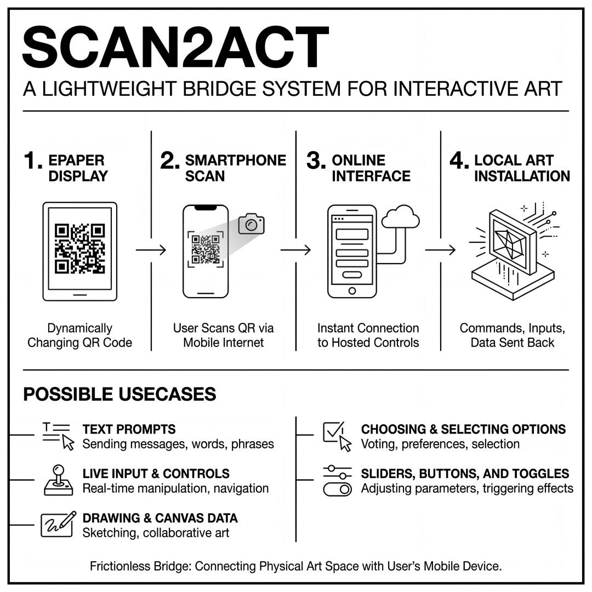

# scan2act



**scan2act** is a lightweight bridge system that lets people interact with local interactive installations using their own smartphones and normal mobile internet. 

By scanning a dynamically changing QR code on a local display, users are instantly connected to a cloud-hosted interface where they can send commands, inputs, or data back to the local installation. It's a convenient, frictionless way to bridge the physical installation space with the user's mobile device.

**Possible Usecases:**
- Text Prompts (e.g., for AI Image Generation like ComfyUI)
- Live Input & Controls
- Drawing & Canvas Data
- Choosing & Selecting Options
- Sliders, Buttons, and Toggles

## Directory Structure

- `cloud/`: Contains the PHP backend (`backend.php`) and the web frontend (`index.html`) that users access with their phones. This should be hosted on a web server accessible via the internet.
- `local/`: Contains the Python application (`app.py`) that runs on the computer connected to your ComfyUI generation instance, and a local visualizer (`display.html`) to show incoming data on a screen.

## Setup Instructions

1. **Cloud Setup (Web Server):**
   Upload the contents of the `cloud/` folder to your web server (e.g., Apache, Nginx) that supports PHP. The `backend.php` will automatically create a `data.json` file in that directory when it's first accessed, so make sure the directory is writable by the web server.
   *(For local testing, you can navigate to the `cloud/` directory and run `php -S localhost:8000`)*

2. **Local Setup (Display & ComfyUI machine):**
   Install the Python dependencies:
   ```bash
   pip install requests qrcode PyQt5
   ```
   
   Open `local/app.py` and update the `BACKEND_URL` and `FRONTEND_URL` to point to your hosted cloud server. You can also configure the interaction type by changing the `MODE` variable:
   - `MODE = 1`: Text Prompt (ComfyUI)
   - `MODE = 2`: Drawing/Canvas Interface
   - `MODE = 3`: Yes / No Buttons
   - `MODE = 4`: Five Horizontal Sliders (0-100)
   - `MODE = 5`: Voting Buttons (1-10)
   
   Run the display application:
   ```bash
   python app.py
   ```

   **Local Display:** You can optionally open `local/display.html` in any web browser on the same machine. It automatically connects to the Python app's background server and visually renders incoming data (text, drawings, slider values, choices, and votes) in real-time.

4. **Usage:**
   - The Python app (`app.py`) will display a QR code locally.
   - A user scans the QR code with their mobile device, opening the cloud-hosted web interface.
   - The user inputs their data (e.g., text, slider values, drawing) on the web page and submits.
   - The Python app immediately detects the input, prints it to the console, pushes it to `display.html`, and generates a new, fresh QR code for the next user. From here, you can hook the Python script into any local system (ComfyUI, TouchDesigner, Arduino, OSC, etc.).
